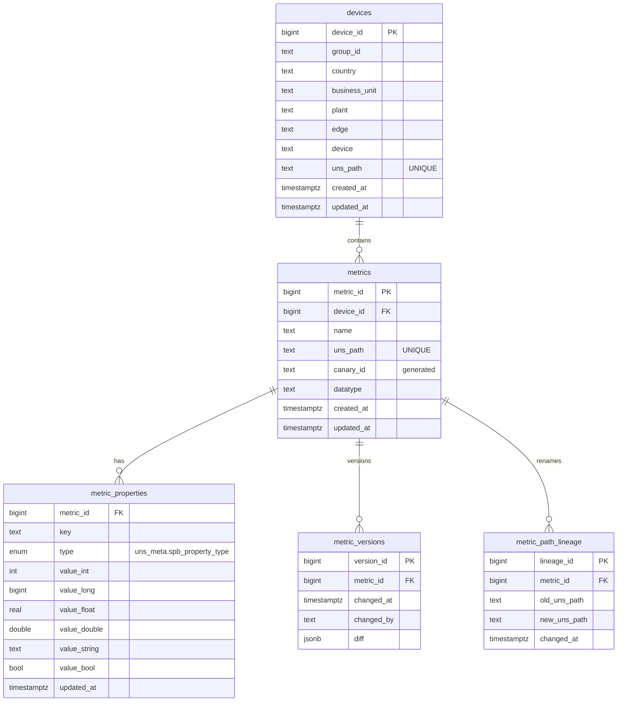

## PostgreSQL schema (DDL, copy‑paste ready)

```sql
-- Database: uns_metadata
-- Schema: uns_meta

CREATE SCHEMA IF NOT EXISTS uns_meta;

-- Helper to maintain updated_at timestamps
CREATE OR REPLACE FUNCTION uns_meta.set_updated_at() RETURNS trigger AS $$
BEGIN
  NEW.updated_at := now();
  RETURN NEW;
END;$$ LANGUAGE plpgsql;

/* =====================
   devices
   ===================== */
CREATE TABLE IF NOT EXISTS uns_meta.devices (
  device_id     BIGSERIAL PRIMARY KEY,
  group_id      TEXT        NOT NULL,          -- Sparkplug B Group ID
  country       TEXT        NOT NULL,
  business_unit TEXT        NOT NULL,
  plant         TEXT        NOT NULL,
  edge          TEXT        NOT NULL,          -- Sparkplug B Node ID
  device        TEXT        NOT NULL,          -- Sparkplug B Device ID
  -- Canonical UNS identity for the device context
  uns_path      TEXT        NOT NULL UNIQUE,
  created_at    TIMESTAMPTZ NOT NULL DEFAULT now(),
  updated_at    TIMESTAMPTZ NOT NULL DEFAULT now(),
  CONSTRAINT uq_devices_spb_identity UNIQUE (group_id, edge, device)
);

CREATE INDEX IF NOT EXISTS idx_devices_plant    ON uns_meta.devices (plant);
CREATE INDEX IF NOT EXISTS idx_devices_uns_path ON uns_meta.devices (uns_path);

CREATE TRIGGER trg_devices_updated_at
BEFORE UPDATE ON uns_meta.devices
FOR EACH ROW EXECUTE FUNCTION uns_meta.set_updated_at();

/* =====================
   metrics
   ===================== */
CREATE TABLE IF NOT EXISTS uns_meta.metrics (
  metric_id   BIGSERIAL PRIMARY KEY,
  device_id   BIGINT      NOT NULL REFERENCES uns_meta.devices(device_id) ON DELETE CASCADE,
  name        TEXT        NOT NULL,             -- Sparkplug metric name (e.g., "Temperature/PV")
  uns_path    TEXT        NOT NULL UNIQUE,      -- Canonical UNS path for the metric (slash‑separated)
  canary_id   TEXT        GENERATED ALWAYS AS (replace(uns_path, '/', '.')) STORED,
  datatype    TEXT        NOT NULL,             -- Sparkplug datatype (as provided)
  created_at  TIMESTAMPTZ NOT NULL DEFAULT now(),
  updated_at  TIMESTAMPTZ NOT NULL DEFAULT now(),
  -- Enforces uniqueness across (group_id, edge, device, name) via FK to devices
  CONSTRAINT uq_metric_spb_identity UNIQUE (device_id, name)
);

CREATE INDEX IF NOT EXISTS idx_metrics_device_id ON uns_meta.metrics (device_id);
CREATE INDEX IF NOT EXISTS idx_metrics_canary_id ON uns_meta.metrics (canary_id);
CREATE INDEX IF NOT EXISTS idx_metrics_uns_path  ON uns_meta.metrics (uns_path);

CREATE TRIGGER trg_metrics_updated_at
BEFORE UPDATE ON uns_meta.metrics
FOR EACH ROW EXECUTE FUNCTION uns_meta.set_updated_at();

/* =====================
   Sparkplug property type enum + metric_properties (typed)
   ===================== */
-- Strict enum for Sparkplug property typing
DO $$
BEGIN
  IF NOT EXISTS (
    SELECT 1 FROM pg_type t
    WHERE t.typname = 'spb_property_type'
      AND t.typnamespace = 'uns_meta'::regnamespace
  ) THEN
    CREATE TYPE uns_meta.spb_property_type AS ENUM ('int','long','float','double','string','boolean');
  END IF;
END$$;

CREATE TABLE IF NOT EXISTS uns_meta.metric_properties (
  metric_id     BIGINT      NOT NULL REFERENCES uns_meta.metrics(metric_id) ON DELETE CASCADE,
  key           TEXT        NOT NULL,
  type          uns_meta.spb_property_type NOT NULL,
  value_int     INTEGER,
  value_long    BIGINT,
  value_float   REAL,
  value_double  DOUBLE PRECISION,
  value_string  TEXT,
  value_bool    BOOLEAN,
  updated_at    TIMESTAMPTZ NOT NULL DEFAULT now(),
  PRIMARY KEY (metric_id, key),
  CONSTRAINT chk_metric_properties_type_value CHECK (
    (type = 'int'     AND value_int    IS NOT NULL AND value_long IS NULL AND value_float IS NULL AND value_double IS NULL AND value_string IS NULL AND value_bool IS NULL) OR
    (type = 'long'    AND value_long   IS NOT NULL AND value_int  IS NULL AND value_float IS NULL AND value_double IS NULL AND value_string IS NULL AND value_bool IS NULL) OR
    (type = 'float'   AND value_float  IS NOT NULL AND value_int  IS NULL AND value_long  IS NULL AND value_double IS NULL AND value_string IS NULL AND value_bool IS NULL) OR
    (type = 'double'  AND value_double IS NOT NULL AND value_int  IS NULL AND value_long  IS NULL AND value_float  IS NULL AND value_string IS NULL AND value_bool IS NULL) OR
    (type = 'string'  AND value_string IS NOT NULL AND value_int  IS NULL AND value_long  IS NULL AND value_float  IS NULL AND value_double IS NULL AND value_bool IS NULL) OR
    (type = 'boolean' AND value_bool   IS NOT NULL AND value_int  IS NULL AND value_long  IS NULL AND value_float  IS NULL AND value_double IS NULL AND value_string IS NULL)
  )
);

CREATE INDEX IF NOT EXISTS idx_prop_metric_updated ON uns_meta.metric_properties (metric_id, updated_at DESC);

CREATE TRIGGER trg_metric_properties_updated_at
BEFORE UPDATE ON uns_meta.metric_properties
FOR EACH ROW EXECUTE FUNCTION uns_meta.set_updated_at();

/* =====================
   metric_versions (append‑only audit trail of property diffs)
   ===================== */
CREATE TABLE IF NOT EXISTS uns_meta.metric_versions (
  version_id BIGSERIAL   PRIMARY KEY,
  metric_id  BIGINT      NOT NULL REFERENCES uns_meta.metrics(metric_id) ON DELETE CASCADE,
  changed_at TIMESTAMPTZ NOT NULL DEFAULT now(),
  changed_by TEXT        NOT NULL DEFAULT 'system',
  diff       JSONB       NOT NULL            -- property‑level DIFF written by the app
);

CREATE INDEX IF NOT EXISTS idx_versions_metric_changed ON uns_meta.metric_versions (metric_id, changed_at DESC);

/* =====================
   metric_path_lineage (rename lineage: old → new UNS path for same metric_id)
   ===================== */
CREATE TABLE IF NOT EXISTS uns_meta.metric_path_lineage (
  lineage_id   BIGSERIAL   PRIMARY KEY,
  metric_id    BIGINT      NOT NULL REFERENCES uns_meta.metrics(metric_id) ON DELETE CASCADE,
  old_uns_path TEXT        NOT NULL,
  new_uns_path TEXT        NOT NULL,
  changed_at   TIMESTAMPTZ NOT NULL DEFAULT now(),
  CONSTRAINT uq_lineage UNIQUE (metric_id, old_uns_path, new_uns_path)
);

CREATE INDEX IF NOT EXISTS idx_lineage_old ON uns_meta.metric_path_lineage (old_uns_path);
CREATE INDEX IF NOT EXISTS idx_lineage_new ON uns_meta.metric_path_lineage (new_uns_path);

/* =====================
   CDC publication (as per reference SQL in the doc)
   ===================== */
-- NOTE: The app creates the logical replication slot (pgoutput). Run once:
CREATE PUBLICATION uns_meta_pub FOR TABLE
  uns_meta.metrics,
  uns_meta.metric_properties;
```

---

## ERD (Mermaid)



---

## Decisions — Resolved

1. **CDC scope**: publish **metrics** and **metric\_properties** only (minimal set for Canary sync).
2. **Property typing**: **strict enum** (`int | long | float | double | string | boolean`).
3. **Value storage**: **typed columns** per enum with a CHECK that enforces exactly one column per row is set.
4. **Rename lineage**: keep current minimal structure (no `changed_by` required).
5. **Uniqueness**: `uns_path` is UNIQUE on both **devices** and **metrics**; **devices** are UNIQUE per `(group_id, edge, device)`; **metrics** enforce `(group_id, edge, device, metric name)` via `UNIQUE (device_id, name)` (constraint `uq_metric_spb_identity`).
6. **Generated `canary_id`**: keep stored generated column from `uns_path`.
7. **Retention**: keep full history (no DB‑level pruning).
