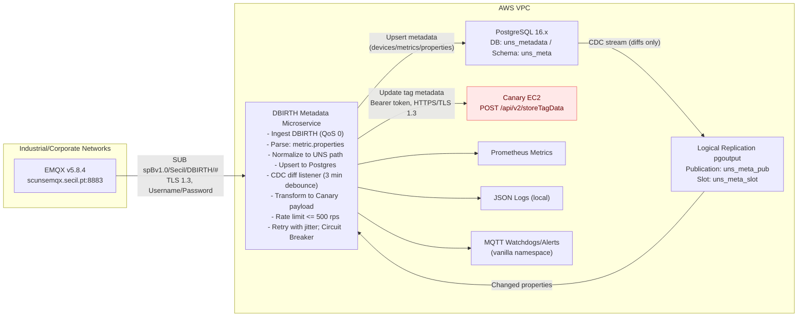

|                     |                                                                                                                                                                                                                                                                                                                                                                                                                                                                                                                                                                                                                                                                                                                                                                                                    |
| ------------------- | -------------------------------------------------------------------------------------------------------------------------------------------------------------------------------------------------------------------------------------------------------------------------------------------------------------------------------------------------------------------------------------------------------------------------------------------------------------------------------------------------------------------------------------------------------------------------------------------------------------------------------------------------------------------------------------------------------------------------------------------------------------------------------------------------- |
| **Release Number**  | **1.1**                                                                                                                                                                                                                                                                                                                                                                                                                                                                                                                                                                                                                                                                                                                                                                                            |
| **Epic**            | \|Type\|Key\|Summary\|Assignee\|Priority\|Status\|Updated\| \|---\|---\|---\|---\|---\|---\|---\| \|\|[UNS-1199](https://secil-pt.atlassian.net/browse/UNS-1199)\|Resolve UNS reliability issues: data corruption, store-and-forward failures, and system integrity problems to ensure stable and lossless data flow.\|Unassigned\|  Medium\|Backlog\|Aug 22, 2025, 11:49\|  Synced just now  •  [1 item](https://secil-pt.atlassian.net/issues/?jql=\(text%20~%20%22UNS-1199*%22%20or%20summary%20~%20%22UNS-1199*%22%20or%20key%20%3D%20UNS-1199\)%20and%20project%20in%20\(UNS\)%20ORDER%20BY%20created%20DESC) |
| **Document status** | final                                                                                                                                                                                                                                                                                                                                                                                                                                                                                                                                                                                                                                                                                                                                                                                              |
| **Document owner**  | @Duarte Cecilio                                                                                                                                                                                                                                                                                                                                                                                                                                                                                                                                                                                                                                                                                                                                                                                    |
| **Arch Designer**   | @Duarte Cecilio                                                                                                                                                                                                                                                                                                                                                                                                                                                                                                                                                                                                                                                                                                                                                                                    |
| **Publish Date**    | Aug 26, 2025                                                                                                                                                                                                                                                                                                                                                                                                                                                                                                                                                                                                                                                                                                                                                                                       |

---

## 🎯 Business Context

**Business driver.** Establish a Unified Namespace (UNS) to make onboarding new OT systems and additional plants cost‑effective while ensuring tag metadata is governed centrally. This microservice enables **event‑driven metadata propagation**: when tag metadata changes at the edge or in Ignition, those changes are reflected across the UNS and into Canary without manual work.

**Problem we are solving.** Sparkplug B `DBIRTH` messages carry all tag **metric properties (metadata)** but the values they carry contain a wrong timestamp, which can pollute the historian with "fake events". We separate metadata from timeseries and persist it in a **single metadata store (PostgreSQL)**. From there, **CDC** publishes only **changed metadata** to Canary via its Write API (`/storeData`), keeping Canary’s tag/asset model synchronized and avoiding spurious historical events.

**Business impact.**

- **Faster integrations**: standardized metadata onboarding for any Sparkplug publisher connected to the EMQX broker.

- **Consistent access & discoverability**: metadata changes (e.g., visibility, units, scaling, descriptions) propagate so users’ Canary views stay accurate; access control enforcement remains consistent across sites.

- **Auditability**: versioned metadata in Postgres (with CDC history) provides an audit trail of who/what changed.

**In scope — Release 1.0.**

- Consume **only** Sparkplug B `DBIRTH` from the **Ignition Cloud MQTT Transmitter** (aggregates all plants) to capture **all tag metadata** centrally.

- Persist **all key/value pairs** found under each metric’s `properties` object; **no metrics are ignored**.

- Map metadata into the UNS framing: `Secil/<Country>/<Business Unit>/<Plant>/…` for downstream systems (incl. Canary naming/paths).

**Out of scope.** Processing of `DDATA`, `DDEATH`, or other Sparkplug messages (handled by existing collectors) and any manual approval/change‑board processes.

**Stakeholders.** Indirect consumers: OT Engineers, DT Platform, Canary admins, Data/Analytics teams, and Plant Ops—impacted via improved tag metadata quality in Canary. No formal approvals/change boards required.

**Success criteria (KPIs).** 100% of `DBIRTH`s parsed (seldom publications); **==<60 s==** ==latency== from Ignition Transmitter refresh to Canary; **100% parity** between Postgres and Canary; **zero duplicate** tag registrations; **complete audit trail** of metadata changes.

**Constraints & dependencies.** EMQX v5.8.4 with TLS; Sparkplug namespace already publishing and Canary historizing `DDATA`. Canary hosted on AWS EC2 (managed by Secil). PostgreSQL version & CDC approach to be finalized during design (target: native logical replication with logical decoding).

**Governance & security.** Metadata ownership: **UNS‑OT team**. Sparkplug metric names carry ISA‑95 context and must be conformed to UNS paths. All traffic remains inside Secil industrial/corporate networks and AWS VPC.

**==Known risks==.** Vendor inconsistencies in Sparkplug metadata; potential `DBIRTH` storms/race conditions after restarts; Canary API throttling (must protect with backoff/rate limits); duplicate topics mitigated by organization‑wide ISA‑95‑style UNS structure.

## 📊 ==Functional Requirements==

|   |   |   |
|---|---|---|
|**Functional Requirement**|**User**|**Priority**|
|Ingest only Sparkplug B DBIRTH from EMQX via topic `spBv1.0/Secil/DBIRTH/#`.|DT Platform (UNS‑OT)|Must Have|
|Parse DBIRTH metrics; extract and preserve complete `properties` map (common + custom).|DT Platform (UNS‑OT)|Must Have|
|Derive canonical identities: UNS path (`/`) and Canary tag id (`.` path).|DT Platform (UNS‑OT)|Must Have|
|Maintain lineage on renames (no new identity on rename).|DT Platform (UNS‑OT)|Must Have|
|Normalize UNS path: `Secil/<Country>/<Business Unit>/<Plant>/…` and map to Canary path with dots.|DT Platform (UNS‑OT)|Must Have|
|Upsert metadata to PostgreSQL (devices/metrics/properties + versions for audit/CDC).|DT Platform (UNS‑OT)|Must Have|
|CDC emits **diffs only** on property changes.|DT Platform (UNS‑OT)|Must Have|
|==Apply== **==3‑minute debounce==** ==window after Ignition Transmitter refresh to collapse bursts.==|DT Platform (UNS‑OT)|Must Have|
|Publish changed metadata to Canary `/storeData` with **update** behavior.|Canary Admin|Must Have|
|Enforce rate limit ≤ **500 req/s**; batch, retry with exponential backoff + jitter.|DT Platform (UNS‑OT)|Must Have|
|Idempotent updates to Canary using canonical identity; avoid duplicates.|Canary Admin|Must Have|
|==Observability: Prometheus metrics (DBIRTHs processed, metrics parsed, upserts, CDC diffs, Canary ok/fail, retries, queue depth, end‑to‑end latency p50/p95).==|DT Platform (UNS‑OT)|Must Have|
|Structured **JSON** logging to local file; pluggable sink integration later.|DT Platform (UNS‑OT)|Must Have|
|Transport security: mTLS to EMQX; HTTPS/TLS to Canary; secrets via `.env`.|DT Platform (UNS‑OT)|Must Have|
|Bulk backfill of metadata to Canary (operator‑triggered).|DT Platform (UNS‑OT)|Nice to Have|
|Dry‑run/validation mode (parse, normalize, diff; no writes).|DT Platform (UNS‑OT)|Nice to Have|
|Preview diffs before publish (human review step or export).|Data/Analytics|Could Have|
|Replay by time window from CDC log (rebuild Canary), with safeguards.|DT Platform (UNS‑OT)|Could Have|
|Circuit‑breaker **UI** to pause Canary writes when error rate exceeds threshold.|DT Platform (UNS‑OT)|Could Have|

## 📊 ==NonFunctional Requirements==

|   |
|---|
|**NonFunctional Requirement**|
|**Availability:** 99.9% monthly SLO. Single Docker service on EC2 with auto‑restart on failure; maintenance performed outside plant operating peaks.|
|**Performance / Scale:** Sustain DBIRTH bursts up to **1,000,000 metrics per DBIRTH** using streaming parsing, bounded memory buffers, and backpressure to Canary (≤ **500 req/s**).|
|**PostgreSQL:** Recommend **PostgreSQL 16.x**; use **native logical replication** (`pgoutput`) for CDC (no Debezium). Publication limited to metadata tables only.|
|**CDC & WAL guardrails:** Dedicated replication slot; monitor slot lag; alert if WAL retained > 5 GB or slot age > 1 h; automatic catch‑up on restart.|
|**Backup & Recovery:** Daily automated snapshots; optional WAL archiving. Target **RPO ≤ 15 min**, **RTO ≤ 1 h** for DB recovery.|
|**Retry policy (network/transient):** Exponential backoff with jitter for Canary calls: 6 attempts, per‑attempt timeout 10 s, backoff 0.2s → 0.4 → 0.8 → 1.6 → 3.2 → 6.4 s; total time budget ≤ 60 s per operation. MQTT reconnect with capped backoff ≤ 30 s.|
|**Circuit breaker (service protection):** Open when Canary 5xx error rate ≥ 2% over 1 min or ≥20 consecutive failures; hold 60 s, then half‑open probe; queue changes locally until closed.|
|**Security:** Enforce **TLS 1.3** end‑to‑end; **mTLS to EMQX**; HTTPS to Canary. Use organization wildcard certificate where applicable; client certs for mTLS identity.|
|**Secrets:** `.env` for secret storage; file perms 600; rotate quarterly. Roadmap: migrate to AWS Secrets Manager/KMS when available.|
|**Logging:** Structured **JSON** logs to local file with rotation (daily or 100 MB), retain **14 days**, max **1 GB** disk per instance.|
|**Observability:** Expose Prometheus metrics (defaults). Publish watchdog/alert events to vanilla MQTT namespace for Ignition Cloud monitoring.|
|**Deployment:** Docker on EC2 (Linux x86_64). Systemd (or ECS/compose) manages service lifecycle with `restart=always`. Rolling restarts acceptable; blue/green not required for Release 1.0.|
|**Data retention (metadata history):** Retain full version history for audit; periodic housekeeping to archive aged versions if storage pressure occurs.|
|**Schema evolution:** Backward‑compatible, additive migrations only; versioned migrations applied with zero‑downtime procedure.|
|**Compliance & Residency:** No PII/PHI; traffic confined to Secil industrial/corporate networks and AWS VPC; no at‑rest encryption mandated.|

## 🤔 Assumptions

- **DBIRTH content:** Each DBIRTH metric includes a `properties` object (may be empty).

- **UNS identity:** The UNS path is the unique, stable identity for each metric; lineage across renames is preserved via internal mapping tables.

- **Topic & namespace:** All DBIRTHs are received on `spBv1.0/Secil/DBIRTH/#` and contain sufficient Group/Edge/Device/Metric context to derive the UNS path.

- **Canary behavior:** Canary supports idempotent updates via `/storeData`; missing tags may be created as needed but default behavior is **update**. Throughput target ≤ **500 req/s** is acceptable on the EC2 host.

- **Time & ordering:** NTP‑synchronized clocks across Ignition, EMQX, EC2, and Postgres; eventual consistency is acceptable.

- **Network & security:** Routing and firewall rules are in place for mTLS MQTT and HTTPS to Canary between industrial/corporate networks and AWS VPC.

- **Database ownership:** UNS‑OT team owns Postgres schema, roles, and replication slots.

- **Failure modes:** On Canary outage or circuit‑breaker open, updates are queued on disk; capacity sized for ≥ **24h** backlog.

- **Data scope:** Only operational metadata; no PII/PHI; internal audit only.

- **Operational boundaries:** Release 01 is operated solely by UNS‑OT; no external interfaces.

## 🗒️ System Connections

> In order to close the design, the following list should be checked:
>
> - Access credentials for all systems (authentication URL if applicable)
>
> - System access configs: host, ports, endpoint, DB schema, RFC/Webservice
>
> - Service user with required permissions
>

### EMQX Broker — DBIRTH Intake

|   |   |
|---|---|
|Item|Value|
|**Host / Port**|`scunsemqx.secil.pt:8883`|
|**Protocol**|MQTT over TLS 1.3|
|**Auth**|**Username/Password** (per user input). _Note:_ This differs from NFR mTLS; upgrade to mTLS can be a roadmap item.|
|**Username / Password**|`${EMQX_USERNAME}` / `${EMQX_PASSWORD}` (from `.env`)|
|**Topic filter**|`spBv1.0/Secil/DBIRTH/#`|
|**QoS**|**0** (Sparkplug DBIRTH per plant convention)|
|**Clean Session / Session Expiry**|Clean Session **true** (stateless consumer)|
|**Client ID**|`uns-spb-dbirth-meta-<env>-<node>`|
|**Keepalive**|30 s|

### PostgreSQL — Metadata Store + CDC

|   |   |
|---|---|
|Item|Value|
|**Host / Port**|`TBD: postgres.uns.secil:5432` (==placeholder==)|
|**DB / Schema**|`uns_metadata` / `uns_meta`|
|**App user (RW)**|`uns_meta_app` / `${PG_APP_PASSWORD}`|
|**Replication user**|`uns_meta_cdc` / `${PG_REPL_PASSWORD}`|
|**TLS**|TLS 1.3 (verify-full)|
|**Publication**|`uns_meta_pub` → tables: `devices, metrics, metric_properties, versions`|
|**Replication slot**|`uns_meta_slot` (logical, plugin `pgoutput`)|
|**Backups**|Daily snapshot; optional WAL archiving (per NFR)|

### Canary Write API — Metadata Updates

|   |   |
|---|---|
|Item|Value|
|**Base URL**|`https://scunscanary.secil.pt:55293`|
|**Endpoint**|`POST /api/v2/storeTagData`|
|**Auth**|Bearer token `Authorization: Bearer ${CANARY_TOKEN}`|
|**Rate limit**|≤ **500 req/s** (per NFR)|
|**Timeout / Retries**|10 s per attempt; 6 attempts; exp backoff with jitter (per NFR)|

#### Canary Write API – Updated Details

- SAF base: `https://scunscanary.secil.pt:55293/api/v1`
- Views base: `https://scunscanary.secil.pt:55293/api/v2`
- Primary write: `POST /storeData` (properties-only writes — no values/TVQs)
- Auth/session (SAF):
  - Acquire via `POST /getSessionToken` with body fields:
    - `apiToken=${CANARY_API_TOKEN}`
    - `historians=["machine"]` (or from `CANARY_HISTORIANS`)
    - `clientId=${CANARY_CLIENT_ID}`
    - `settings.clientTimeout=${CANARY_SESSION_TIMEOUT_MS}` (default 120000)
    - `settings.autoCreateDatasets=${CANARY_SAF_AUTO_CREATE_DATASETS}` (true only for Test dataset)
  - KeepAlive: send `/keepAlive` if idle > `${CANARY_KEEPALIVE_IDLE_SECONDS}` (±`${CANARY_KEEPALIVE_JITTER_SECONDS}`) seconds; refresh on `BadSessionToken`; revoke via `/revokeSessionToken` on shutdown.
- Pre-write path resolution (Views):
  - Use `POST /browseTags` with API token to confirm full path/dataset under `Secil*` (e.g., `Secil`, `Secil2`, `Secil3`).
  - Use `deep=true` and page via `maxSize`/`continuation` as needed until tag `fullPath` matches the expected path.
- Test dataset mode:
  - When `CANARY_DATASET_OVERRIDE=Test`, force writes to `Test` and set `autoCreateDatasets=true` for that session only.
- Rate limiting & retries: 500 rps budget; 10 s per attempt; 6 attempts; exponential backoff with jitter.

Environment Variables (Canary)

|   |   |
|---|---|
|Variable|Meaning|
|`CANARY_SAF_BASE_URL`|SAF base URL (default `https://scunscanary.secil.pt:55293/api/v1`).|
|`CANARY_VIEWS_BASE_URL`|Views base URL (default `https://scunscanary.secil.pt:55293/api/v2`).|
|`CANARY_API_TOKEN`|API token used for both SAF session acquisition and Views calls.|
|`CANARY_CLIENT_ID`|Client identifier for SAF sessions (e.g., `uns-meta-<env>-<node>`).|
|`CANARY_HISTORIANS`|Comma-separated list of historian targets (e.g., `machine`).|
|`CANARY_SESSION_TIMEOUT_MS`|SAF session client timeout (default `120000`).|
|`CANARY_KEEPALIVE_IDLE_SECONDS`|Idle period before sending keepAlive (default `30`).|
|`CANARY_KEEPALIVE_JITTER_SECONDS`|Jitter applied to keepAlive cadence (default `10`).|
|`CANARY_SAF_AUTO_CREATE_DATASETS`|Enable dataset auto-create (default `false`, set `true` only for `Test`).|
|`CANARY_DATASET_PREFIX`|Dataset prefix used in resolution (default `Secil`).|
|`CANARY_DATASET_OVERRIDE`|Override dataset for writes (set to `Test` for validation runs`).|

### Service Identities & Permissions

|   |   |
|---|---|
|System|Permission|
|**EMQX**|Allow **SUB** on `spBv1.0/Secil/DBIRTH/#` for service principal (username).|
|**PostgreSQL**|App user: SELECT/INSERT/UPDATE on `uns_meta` tables. Replication user: REPLICATION, LOGIN; publication on metadata tables only.|
|**Canary**|API token scope permits SAF session (`/api/v1/getSessionToken`), writes via `/api/v1/storeData`, and Views browse via `/api/v2/browseTags`.

### Network & DNS

|   |   |
|---|---|
|Item|Value|
|**Connectivity**|EC2 (service) ↔ EMQX : 8883/TLS. EC2 (service) ↔ Canary EC2 : HTTPS 55293.|
|**Firewall/SGs**|Allow egress from service to above ports; restrict ingress to Prometheus/SSH per ops policy.|
|**Proxy/NAT**|None (direct) unless noted later.|
|**DNS**|As above; additional DB DNS to be confirmed when Postgres is provisioned.|

### Secrets & Files

|   |   |
|---|---|
|Item|Value|
|**.env path**|`/opt/app/.env` (permissions 600)|
|**Certs path (if/when mTLS adopted)**|`/certs` (read‑only mount)|
|**Rotation cadence**|Quarterly (username/password & tokens); ad‑hoc on incident.|

— End of System Connections —

## 🧩 Data Flow Diagram

## 🗒️ Service/Script Design

- **Runtime & Packaging**

    - Language: **Python 3.13**; base image: `python:3.13-slim` (non‑root user; tini as init; distroless possible later).

    - Key deps: `paho-mqtt`, `sparkplug_b_pb2`, `psycopg[binary]` (v3), `uvloop` (Linux), `prometheus-client`, `orjson`, `tenacity` (retries).

    - Processes: single container with **async I/O**; components as tasks: **MQTT Consumer**, **DB Upserter**, **CDC Listener**, **Canary Writer**, **Metrics/Health**.

- **MQTT Intake (Sparkplug DBIRTH)**

    - Subscribe: `spBv1.0/Secil/DBIRTH/#` with **QoS 0** (per constraint), **clean session = true**.

    - TLS 1.3; **Username/Password** auth from `.env` (`EMQX_HOST`, `EMQX_USERNAME`, `EMQX_PASSWORD`).

    - Parse Sparkplug B payloads using your **existing Python boilerplate** (metric list + `properties` map). Handle retained DBIRTHs idempotently.

- **Identity & Normalization**

    - Canonical identity: **UNS path with** `/`; Canary tag id: **UNS path with** `.`.

    - Maintain **rename lineage** (mapping table from old → new UNS path).

    - Persist **all** keys within `metric.properties` (common + custom) without renaming; enforce UTF‑8 and size caps.

- **PostgreSQL Upsert & Versioning**

    - Schema (logical):

        - `devices(device_id PK, edge, device, plant, business_unit, country, uns_path)`

        - `metrics(metric_id PK, device_id FK, name, uns_path, canary_id, datatype, created_at, updated_at)`

        - `metric_properties(metric_id FK, key, value, type, updated_at, PRIMARY KEY(metric_id, key))`

        - `metric_versions(version_id PK, metric_id FK, changed_at, changed_by, diff jsonb)`

    - Upsert flow: compare incoming properties vs last committed snapshot → **compute DIFF** (key‑level changes only) → write rows + append `metric_versions.diff`.

- **CDC (native logical replication)**

    - Publication: `uns_meta_pub` (tables: `metrics`, `metric_properties`). Slot: `uns_meta_slot` (plugin `pgoutput`).

    - **CDC Listener** consumes the replication stream directly (no Debezium), translates row changes into **property‑level diffs**.

    - Apply **3‑minute debounce** after Ignition Transmitter Refresh (burst collapse); then enqueue diffs to Canary Writer.

- **Canary Writer (/api/v2/storeTagData)**

    - Rate limit: **≤ 500 requests/sec** (token bucket, per‑host). Parallelize across sites when safe.

    - Retries: **tenacity** with exponential backoff + jitter (6 attempts, per NFR). Circuit breaker opens on elevated 5xx.

    - **Send only changed metadata** (no timeseries) using the `properties` block. Build tag ids by converting `/` → `.`.

- **Example Canary request (properties‑only)**

    `{ "sessionToken": "${CANARY_TOKEN}", "properties": { "Secil.Portugal.Cement.Maceira.Kiln.Temperature.PV": [ [ "2025-08-26T12:00:00.0000000Z", "engUnit=°C", 192 ], [ "2025-08-26T12:00:00.0000000Z", "displayHigh=1800", 192 ] ] } }`

    _Notes_: `sessionToken` comes from `.env`; each inner array represents a **timestamped property update** with **quality=192**. Tag ids use the **dot‑separated UNS path**. Include only **diffed** keys in the batch. If you also need to persist a TVQ sample for certain tags, use the `tvqs` block alongside `properties` (per your sample payload).

- **Python payload assembly (sketch)**

    `from datetime import datetime, timezone import orjson, requests def to_canary_id(uns_path: str) -> str: return uns_path.strip('/').replace('/', '.') def build_properties_body(token: str, diffs: dict[str, dict[str, str]]): # diffs: { uns_path: { key: value, ... }, ... } ts = datetime.now(timezone.utc).isoformat().replace('+00:00', 'Z') props: dict[str, list[list[object]]] = {} for uns_path, changes in diffs.items(): tag = to_canary_id(uns_path) entries = [] for k, v in changes.items(): # Canary property encoding: we encode "key=value" as a string; numeric ok too entries.append([ts, f"{k}={v}", 192]) props[tag] = entries return { "sessionToken": token, "properties": props } def post_properties(canary_url: str, body: dict, timeout=10): url = canary_url.rstrip('/') + '/api/v2/storeTagData' headers = {"Content-Type": "application/json"} resp = requests.post(url, data=orjson.dumps(body), headers=headers, timeout=timeout) resp.raise_for_status() return resp`

- **Batching & Idempotency**

    - Batch up to **100 tags** per HTTP call; split when payload > 1 MB.

    - Idempotency key per batch: hash of `{tag, ts, sorted(properties)}` to prevent duplicate submits on retries.

- **Health, Metrics, Logs**

    - `/healthz` (liveness) and `/readyz` (DB + MQTT + rate‑limiter checks).

    - Prometheus at `:9100/metrics` (counters: DBIRTHs, metrics parsed, upserts, CDC diffs, Canary success/failure, retries, p50/p95 latency; gauges: queue depth, circuit state).

    - Logs: structured JSON to file with rotation (daily or 100 MB), retention 14 days.

- **Configuration (.env)**

    - `EMQX_HOST`, `EMQX_USERNAME`, `EMQX_PASSWORD`, `EMQX_TOPIC=spBv1.0/Secil/DBIRTH/#`

    - `PG_HOST`, `PG_DB=uns_metadata`, `PG_SCHEMA=uns_meta`, `PG_USER`, `PG_PASS`, `PG_REPL_USER`, `PG_REPL_PASS`

    - `CANARY_URL=https://scunscanary.secil.pt:55293`, `CANARY_TOKEN`

    - `RATE_LIMIT_RPS=500`, `DEBOUNCE_SECONDS=180`

- **Operational Safeguards**

    - Disk‑backed queue for outage buffering (≥24h capacity). Safe shutdown flush.

    - Circuit breaker with auto half‑open probe; watchdog events published to vanilla MQTT for Ignition Cloud.

- **CDC Setup (reference SQL)**

    `-- Run once after tables are created CREATE PUBLICATION uns_meta_pub FOR TABLE metrics, metric_properties; -- Replication slot is created by the app using pgoutput when connecting.`

## Ignition Tag Structure

_Not applicable for this microservice._

## Broker Topic Structure

**Topic Structure**

- **Sparkplug B (ingress):**

    - Exact subscription: `spBv1.0/Secil/DBIRTH/#`

    - Canonical pattern: `spBv1.0/<GroupId>/DBIRTH/<EdgeNode>/<Device>`

    - This service consumes **only DBIRTH** payloads (metadata) from the Ignition Cloud MQTT Transmitter.

- **UNS identity (logical):**

    - `Secil/<Country>/<Business Unit>/<Plant>/<Area>/<Equipment>/<Metric>`

    - Example paths:

        - `Secil/Portugal/Cement/Maceira/Kiln/K1/Temperature/PV`

        - `Secil/Portugal/Cement/Outão/RawMill/RM1/Vibration/RMS`

- **Canary tag id (outbound):**

    - **Dot‑separated** UNS path (replace `/` with `.`):

        - `Secil.Portugal.Cement.Maceira.Kiln.K1.Temperature.PV`

**Message Payload**

> **DBIRTH (decoded, partial — properties only)**

`{ "group": "Secil", "edgeNode": "Maceira-Ignition-Edge", "device": "Kiln-K1", "metrics": [ { "name": "Temperature/PV", "datatype": "Float", "properties": { "engUnit": "°C", "displayHigh": 1800, "displayLow": 0, "deadband": 0.1, "description": "Kiln K1 process temperature" } }, { "name": "Vibration/RMS", "datatype": "Float", "properties": { "engUnit": "mm/s", "displayHigh": 50, "displayLow": 0, "precision": 2 } } ] }`

> **Outbound to Canary —** `/api/v2/storeTagData` **(properties‑only, diffs)**

`{ "sessionToken": "${CANARY_TOKEN}", "properties": { "Secil.Portugal.Cement.Maceira.Kiln.K1.Temperature.PV": [ ["2025-08-26T12:00:00.0000000Z", "engUnit=°C", 192], ["2025-08-26T12:00:00.0000000Z", "displayHigh=1800", 192] ], "Secil.Portugal.Cement.Outão.RawMill.RM1.Vibration.RMS": [ ["2025-08-26T12:00:00.0000000Z", "precision=2", 192] ] } }`

> Quality code **192** indicates **Good**. Only **changed** properties are included per CDC diff.
