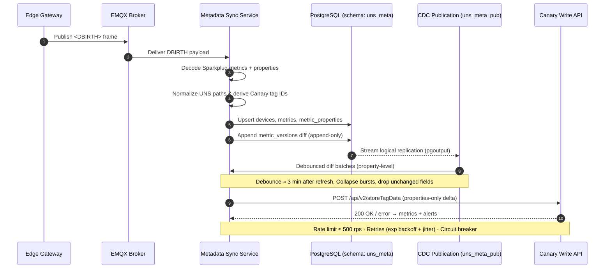

# Identity Lifecycle Runbook (Release 1.1)

## Purpose
- Provide an operational reference for the UNS metadata sync service identity lifecycle.
- Document how tag identities move from Sparkplug DBIRTH to Canary and the guardrails that protect the flow.

## Audience
- Platform operations engineers who support the UNS metadata sync service.
- Data governance and application owners who need to audit canonical tag identity changes.

## System Scope
- Subscribes to Sparkplug B `DBIRTH` traffic from the Ignition Cloud MQTT transmitter via EMQX to capture metric properties.
- Normalizes identities, persists them in PostgreSQL (`uns_metadata`.`uns_meta`), and records version history for audit and CDC.
- Emits property-level diffs only to the Canary Write API (`POST /api/v2/storeTagData`). The service never writes historian timeseries payloads.

---

## Sequence Diagram
The maintained diagram source is in `docs/diagrams/identity-lifecycle.mmd`.



---

## Lifecycle Stages
1. **Ingest (MQTT to service)**
   - Subscription: `spBv1.0/Secil/DBIRTH/#` with QoS 0 and clean session true.
   - Creds provided via `.env` (`EMQX_USERNAME`, `EMQX_PASSWORD`). TLS 1.3 enforced between the service and EMQX.
   - `SparkplugSubscriber.on_message` (see `src/uns_metadata_sync/service.py`) parses each DBIRTH, capturing the metric `properties` map.

2. **Normalization (identity building)**
   - Canonical identity is the UNS path (slash-delimited). Canary tag id is the same path, dot-delimited.
   - `normalize_device_path`, `normalize_metric_path`, and `metric_path_to_canary_id` (see `src/uns_metadata_sync/path_normalizer.py`) sanitize segments, enforce casing, and protect lineage.
   - Renames must populate `metric_path_lineage` before the change so history follows the canonical identity.

3. **Persistence (PostgreSQL)**
   - Core tables: `devices`, `metrics`, `metric_properties`, `metric_versions`, `metric_path_lineage`.
   - `uns_path` is unique on `devices` and `metrics`. `(device_id, name)` is unique for the Sparkplug identity. `canary_id` is generated from `uns_path`.
   - Full DDL and ERD: `docs/Metada Sync Microservice - PostgreSQL Schema & ERD (Release 1.1).md`.

4. **CDC (logical replication)**
   - Publication `uns_meta_pub` exposes `metrics` and `metric_properties` only.
   - Replication slot `uns_meta_slot` uses `pgoutput`. Dedicated DB role `uns_meta_cdc` owns the slot.
   - The service converts row-level changes into property-level diffs, collapsing duplicates inside the debounce window.

5. **Outbound (Canary writer)**
   - Debounce window: 3 minutes after a transmitter refresh to collapse DBIRTH bursts.
   - Rate limit: maximum 500 requests per second. Each request batches approximately 100 tags. Split payloads that exceed 1 MB.
   - Retry policy: 6 attempts, exponential backoff with full jitter, 10 second request timeout, circuit breaker on sustained 4xx/5xx errors.
   - Payload: properties-only delta with timestamp and quality 192 (Good). No timeseries values are sent.

---

## Operational Guardrails
- **Ingress topic**: `spBv1.0/Secil/DBIRTH/#`. No other Sparkplug events are consumed.
- **Debounce**: 3-minute timer per refresh to prevent duplicate updates downstream.
- **Rate limiting**: Hard stop at 500 Canary requests per second; respect the shared tenant allocation.
- **Idempotency**: Canonical UNS path is the source of truth. Canary ids are derived (replace `/` with `.`) and remain stable through renames.
- **Version history**: `metric_versions` retains append-only diffs to satisfy audit needs and CDC replay.

---

## Configuration Reference

### EMQX (DBIRTH intake)
| Setting | Value |
| --- | --- |
| Host and port | `scunsemqx.secil.pt:8883` |
| Protocol | MQTT over TLS 1.3 |
| Auth | Username/password (`EMQX_USERNAME`, `EMQX_PASSWORD`) |
| Topic filter | `spBv1.0/Secil/DBIRTH/#` |
| QoS | 0 |
| Clean session | true |
| Client id pattern | `uns-spb-dbirth-meta-<env>-<node>` |
| Keepalive | 30 seconds |

### PostgreSQL (metadata store and CDC)
| Setting | Value |
| --- | --- |
| Database / schema | `uns_metadata` / `uns_meta` |
| Publication | `uns_meta_pub` (`metrics`, `metric_properties`) |
| Replication slot | `uns_meta_slot` (logical, `pgoutput`) |
| Application role | `uns_meta_app` |
| CDC role | `uns_meta_cdc` |

### Canary Write API (outbound)
| Setting | Value |
| --- | --- |
| Base URL | `https://scunscanary.secil.pt:55293` |
| Endpoint | `POST /api/v2/storeTagData` |
| Auth | `Authorization: Bearer ${CANARY_TOKEN}` |
| Rate limit | <= 500 requests per second |
| Batch size | ~100 tags per request (split > 1 MB) |
| Retries | 6 attempts, exponential backoff with jitter, 10 s timeout |

---

## Database Model Summary
- `devices`: Sparkplug group, edge, device identifiers and canonical device `uns_path`. Unique per `(group_id, edge, device)`.
- `metrics`: Canonical metric `uns_path`, generated `canary_id`, Sparkplug datatype, FK to device.
- `metric_properties`: Typed storage columns (`int_value`, `long_value`, `float_value`, `double_value`, `string_value`, `bool_value`) with a `CHECK` that one column is populated per row.
- `metric_versions`: Append-only property diff history for audit and CDC replay.
- `metric_path_lineage`: Tracks old-to-new UNS paths to preserve identity across renames.

Reference SQL to create the publication:
```sql
CREATE PUBLICATION uns_meta_pub FOR TABLE
  uns_meta.metrics,
  uns_meta.metric_properties;
```

---

## Outbound Payload Contract
- Build the Canary tag id by replacing `/` with `.` in the UNS path.
- Include only the properties that changed. Each property carries the timestamp and `quality = 192`.
- Payloads are idempotent. Re-sending the same diff must not create duplicates or roll back properties.
- Canary responds with HTTP 200 on success. Capture response codes and errors in logs and Prometheus counters.

---

## Troubleshooting Cheatsheet
| Symptom | Likely Cause | Resolution |
| --- | --- | --- |
| Duplicate key on `uns_meta.metrics.uns_path` | Two Sparkplug metrics normalize to the same path (case or separator drift). | Inspect raw names; correct upstream or populate `metric_path_lineage` before rename; rerun CDC replay once resolved. |
| Canary rejects with duplicate tag errors | CDC resend occurred inside the debounce window, causing duplicate submissions. | Confirm debounce worker is running and `metric_versions` diff only contains new properties before resending. |
| Historian shows unexpected timeseries events | A downstream client misclassified metadata as process data. | Ensure outbound payloads remain properties-only and exclude TVQ blocks unless explicitly requested. |
| Rename loses history in Canary | Lineage table missing entry prior to rename. | Insert the old/new mapping into `metric_path_lineage`, backfill metadata, and trigger a fresh diff. |
| Service rate limited by Canary | Burst exceeded 500 rps or retries saturated. | Verify rate limiter settings, check circuit breaker state, and coordinate with Canary owners before lifting caps. |

---

## Observability and Diagnostics
- Prometheus metrics: ingestion counts, normalization errors, database upserts, CDC diff production, Canary successes/failures, retry counters, queue depth, end-to-end latency (p50, p95).
- Logs: structured JSON, 14-day retention. Includes request ids for MQTT intake and outbound HTTP calls.
- Health endpoints: `/healthz` (liveness) and `/readyz` (readiness). Alert when `/readyz` fails for more than 5 minutes.

---

## Security and Secrets
- TLS 1.3 is required end-to-end (MQTT and HTTPS). Current EMQX access uses username/password; mTLS remains on the roadmap.
- Secrets live in `.env` with file permissions set to 600. Rotate quarterly or immediately after suspected compromise.
- Never log raw credentials or bearer tokens. Scrub sensitive fields before emitting structured logs.

---

## Appendix
- **Ingress topic pattern**: `spBv1.0/<GroupId>/DBIRTH/<EdgeNode>/<Device>`. The service only processes the `Secil` group today.
- **UNS path convention**: `Secil/<Country>/<BusinessUnit>/<Plant>/<Area>/<Equipment>/<Metric>`. Canary tag id replaces `/` with `.` using the same segments.
- **Related documents**:
  - `docs/Metadata Sync Microservice Solution Design - Release 1.1.md`
  - `docs/Metada Sync Microservice - PostgreSQL Schema & ERD (Release 1.1).md`
  - `docs/diagrams/identity-lifecycle.mmd`
