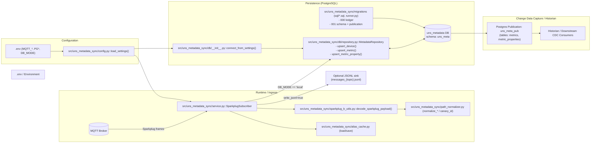

```mermaid
flowchart LR
    Env[".env / Environment"] --> Config["load_settings()"]
    Config --> Subscriber["SparkplugSubscriber"]
    MQTT[(MQTT Broker)] -->|Sparkplug frames| Subscriber
    Subscriber --> AliasCache["Alias Cache JSON"]
    Subscriber --> Normalize["Normalize Device & Metric Paths"]
    Normalize --> Decision{DB_MODE == "local"?}
    Decision -->|No| JSONL["JSONL fallback"]
    Decision -->|Yes| Repo["MetadataRepository"]
    Repo <--> Postgres[(PostgreSQL uns_metadata)]
```

