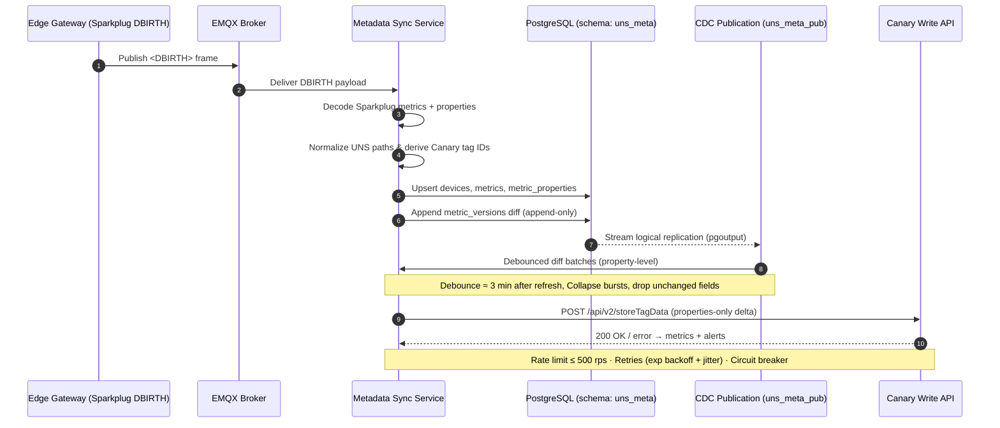

# Identity Lifecycle Runbook

## Purpose
- Describe how identities flow from Sparkplug ingestion through normalization, persistence, and CDC.
- Surface ownership touchpoints so Data Governance can audit path lineage and troubleshoot conflicts quickly.

## Sequence Diagram
The full source lives in [`docs/diagrams/identity-lifecycle.mmd`](../diagrams/identity-lifecycle.mmd).

## Lifecycle Stages
1. **Ingest** - `SparkplugSubscriber.on_message` ([src/uns_metadata_sync/service.py](../../src/uns_metadata_sync/service.py)) consumes DBIRTH/NBIRTH topics via EMQX, resolves aliases, and captures raw metric properties.
2. **Normalization** - `normalize_device_path`, `normalize_metric_path`, and `metric_path_to_canary_id` ([src/uns_metadata_sync/path_normalizer.py](../../src/uns_metadata_sync/path_normalizer.py)) sanitize segments, enforce canonical UNS identities, and derive Canary-friendly identifiers.
3. **Persistence** - Metadata is written into `uns_meta.devices`, `uns_meta.metrics`, `uns_meta.metric_properties`, and `uns_meta.metric_versions` with uniqueness constraints on `uns_path` to prevent duplicates ([docs/Metada Sync Microservice - PostgreSQL Schema & ERD (Release 1.1).md](../Metada%20Sync%20Microservice%20-%20PostgreSQL%20Schema%20&%20ERD%20(Release%201.1).md)).
4. **CDC & Outbound** - Logical publication `uns_meta_pub` streams property diffs to the debounce worker (EP-05). When a batch is ready, the service posts canonical changes to Canary `POST /api/v2/storeTagData` per the contract guidance in [docs/Metadata Sync Microservice Solution Design - Release 1.1.md](../Metadata%20Sync%20Microservice%20Solution%20Design%20-%20Release%201.1.md).

## Key Artifacts
- **Unit tests** - Path safety and identity invariants are asserted in [tests/unit/test_path_normalizer.py](../../tests/unit/test_path_normalizer.py) and MQTT ingestion behavior in [tests/unit/test_service.py](../../tests/unit/test_service.py).
- **Schema DDL** - Full database definition and ERD live in [docs/Metada Sync Microservice - PostgreSQL Schema & ERD (Release 1.1).md](../Metada%20Sync%20Microservice%20-%20PostgreSQL%20Schema%20&%20ERD%20(Release%201.1).md).
- **Contract reference** - The Canary property diff contract, retry envelope, and payload template are documented in the "Canary Writer (/api/v2/storeTagData)" section of [docs/Metadata Sync Microservice Solution Design - Release 1.1.md](../Metadata%20Sync%20Microservice%20Solution%20Design%20-%20Release%201.1.md).

## Troubleshooting Cheatsheet - Path Conflicts
| Symptom | Likely Cause | Resolution |
| --- | --- | --- |
| `ValueError: group/edge required` during normalization | Topic segments missing or trimmed earlier in pipeline. | Confirm EMQX topic matches `spBv1.0/<Group>/<Edge>/<Device>/DBIRTH`; re-request rebirth if alias map is stale. |
| Duplicate key on `uns_meta.metrics.uns_path` | Two metrics normalize to the same canonical path (common with inconsistent separators). | Inspect offending metric names via `alias_cache.json`; adjust source naming or register lineage with `metric_path_lineage`. |
| Canary rejects payload with `duplicateTag` | CDC resend occurred before debounce window expired. | Verify CDC debounce interval (EP-05) and ensure `metric_versions` diff only contains new keys. |
| Renamed metric disappears from Canary | Rename not captured in lineage table, causing new UNS path without migration. | Run lineage backfill: insert `metric_path_lineage` row, confirm CDC publishes diff with old->new mapping before retrying POST. |
| Non-ASCII characters replaced with `_` unexpectedly | Source metric delivered in decomposed form or with hidden whitespace. | Review `normalize_metric_path` behavior; adjust `_normalise_segment` allowlist if domain requires additional characters. |

## Operational Notes
- Alias cache is serialized to `alias_cache.json`; keep under version control for reproducibility during dry runs.
- Metrics with dataset values are flattened via `_metric_value`; ensure downstream schema accepts `rows`/`columns` shape before promoting to production.
- Observability: ingestion, persistence, and outbound retries emit Prometheus counters (`uns_metadata_sync_*`) as detailed in the solution design doc; consult them when validating conflict fixes.
